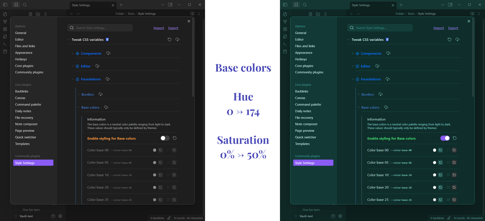
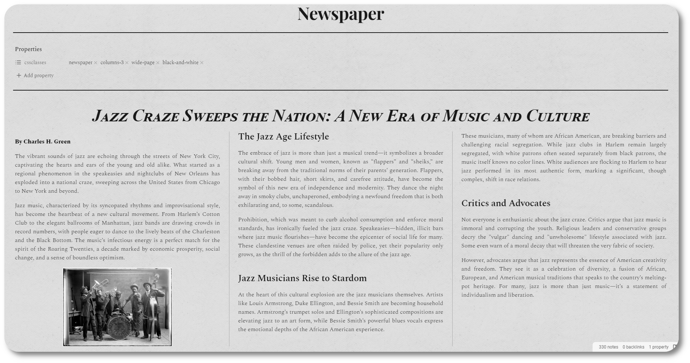

Since I started to spend some time on the Obsidian Discord server, I saw a lot of very cool ideas of customization that are often resolved with css snippets. I try  as much as I can to help to make these ideas work, and sometimes I end up with a nice working code that can be adapted with the Style Settings plugin. When I think these snippets could be of use for other people, might be updated frequently, or are worth keeping because they contain tricky targets/rules, I choose to store them here.

> [!WARNING]
> I do not promise they will be all working perfectly. We are often only two people trying it, so it's not the best beta test ever made. But I'm staying as much available as I can to fix things if there is any issue.

# Installation

Download the `.css` file in the desired folder and add it to your snippets.
Please reffer to the [Obsidian documentation](https://help.obsidian.md/Extending+Obsidian/CSS+snippets) to see how to install a css snippet.

# Updates

I usually don't have any road map for these snippet. They are made quickly to help someone and then upgraded a little bit for fun, but I don't necessarily plan on doing more stuff on them, until someone thinks of another nice feature to add. If you like the idea of one of this snippet but you see that it lacks a feature you would love, feel free to contact me.

If you would like to be contacted in case I update a snippet, so you can download it again, please tell me. I will do my best to not forget.

# Contact

> [!NOTE]
> :fr: I am french, so English is not my first language. I apologize for the mistakes I make and I hope I stay understandable. If you would like to offer a better translation, do not hesitate.

 Open an issue in the repo. Please, specify the snippet you want to ask something about.

 Tag me with `@Kapirklaa` in the official Obsidian Discord server.

# Available Snippets

## [List styling](snippets/list-styling/)

## [Note accent colors](snippets/note-accent-colors/)

## [Tweak CSS Variables](snippets/tweak-css-variables/)

Expose more than 500 CSS variables through the Style Setting Plugin.

## [Newspaper](snippets/newspaper/)

Add a vintage newspaper style to your notes!

## [Callouts](snippets/callouts/)

Add several new callouts layouts.