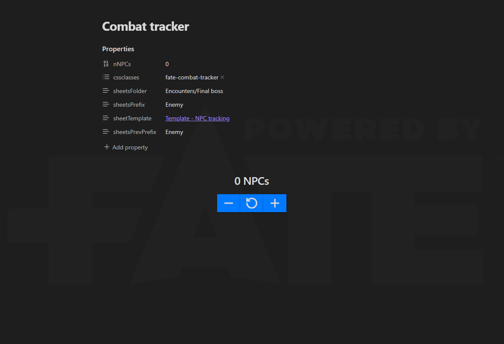
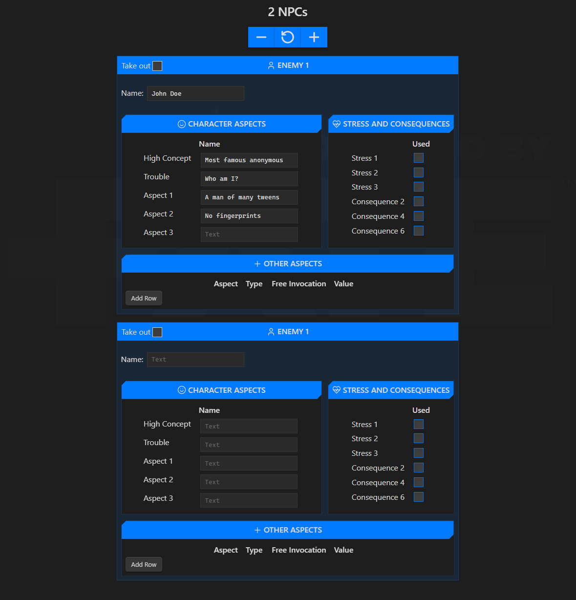
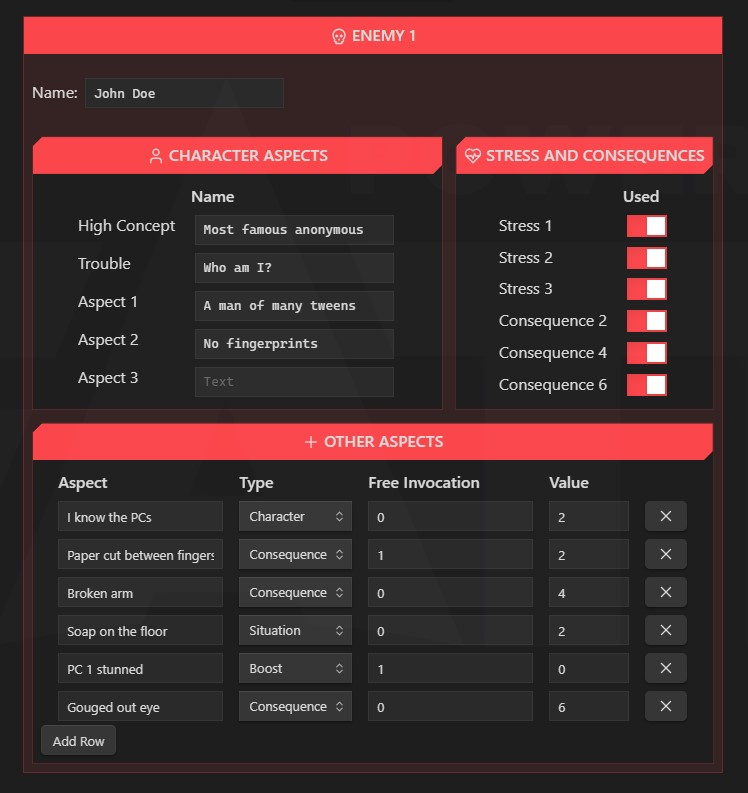

I recently started to DM on the [Fate Core](https://fate-srd.com/fate-core) system, and at some point we had our first fight. I'm terrible at DMing combat scenes, even more keeping track of everything that is going on.

So I decided to create a tool with Obsidian, [Meta Bind](https://github.com/mProjectsCode/obsidian-meta-bind-plugin) and the [JS Engine](https://github.com/mProjectsCode/obsidian-js-engine-plugin).

## How to install

Copy the `Combat tracker.md` in your Vault, wherever you want it.
> [!IMPORTANT]
> Do not remove the properties `sheetsPrevFolder` and `sheetsPrevPrefix`. They are used to prevent the reset of the Meta Bind block that seems to be randomly triggered, I still don't know why. So for now, they are needed for a fix.

Optionally, you can also copy the file `Template - NPC tracking.md` to create every property in one go, but if you don't they should be created when you modify them.

Also, you can add the file `fate-combat-tracker.css` to your [snippets](https://help.obsidian.md/Extending+Obsidian/CSS+snippets) to give it a more Fade vibe, as seen in the screnshots.
I'm using the [official logo](https://fate-srd.com/official-licensing-fate) in the background. If you don't want it (it's an online link), remove the begining of the snippet between the corresponding comments.
> Fate™ is a trademark of Evil Hat Productions, LLC. The Powered by Fate logo is © Evil Hat Productions, LLC and is used with permission.

## How to use

- `nNPCs` is the number of tracking sheets to show. Best is to change it with the buttons, so the corresponding sheets are created.
- `sheetsFolder` is where your NPCs tracking sheet will be created. Be careful about case, se below in Known bugs.
- `sheetsPrefix` is the prefix for the notes that will be created, suffixed by 1, 2, 3, etc.



Once you are all set up, you can start adding NPCs. Files are automatically created, but never deleted. This way, you can keep track of the combat even after starting a new one, by going back to the tracking sheets and see who was injured, who learned something, etc.
If you want to stop a file from being used by the tracker to "save" a state of the tracking sheet, just rename the file so it doesn't match anymore the pattern "`<sheetsPrefix> n`".




You can now fill up any information that happens during a fight.

When the NPCs doesn't have anymore Stress or Consequence box to check, the block turns red.



Corresponding frontmatter is updated
```md
---
consequence2: true
stress1: true
stress2: true
stress3: true
consequence4: true
consequence6: true
name: John Doe
concept: Most famous anonymous
aspect1: A man of many tweens
trouble: Who am I?
aspect2: No fingerprints
otherAspects:
  - type: Character
    name: I know the PCs
    value: 2
  - type: Consequence
    value: 2
    namefreeInvocation: 1
    name: Paper cut between fingers
  - type: Consequence
    value: 4
    name: Broken arm
  - value: 2
    type: Situation
    name: Soap on the floor
  - type: Boost
    name: PC 1 stunned
    namefreeInvocation: 1
  - type: Consequence
    value: 6
    name: Gouged out eye
---
```

## Known issues

- Obsidian API find files and folders with a case sensitive search, but the creation is not. Which means that when working with the folder "Final Boss" when the folder "Final boss" exists won't work. So be careful about the case of your properties and don't use a case-variation of something already existing.
- Meta Bind blocks are reactive, which means they update when the properties are changed. However, I detected updates even when properties didn't change, or at least not in the file (I suspect an update in the cache). This would trigger a reset of the number of shown enemies. As a workaround, I created two properties `sheetsPrevFolder` and `sheetsPrevPrefix` to compare with the previous value before triggerring the refresh of the block. This values are hidden if you use the provided snippet.
- When deleting/moving files that are currently shown in the tracker, binding will be broken and errors will appear. Make sure to refresh when this happens.

## Future features

- **Take out NPCs**: I want to add the possibility to take an NPC out of combat with a toggle. This will add the possibility to say when a NPC is dead, has left or surrendered, and will give the possibility to reduce such blocks to only the title so it doesn't take useless space.
- **Collapsible sections**: for now, I haven't found how to create collapsible callouts with the JS Engine. But I'm hoping to be able to do that at some point.