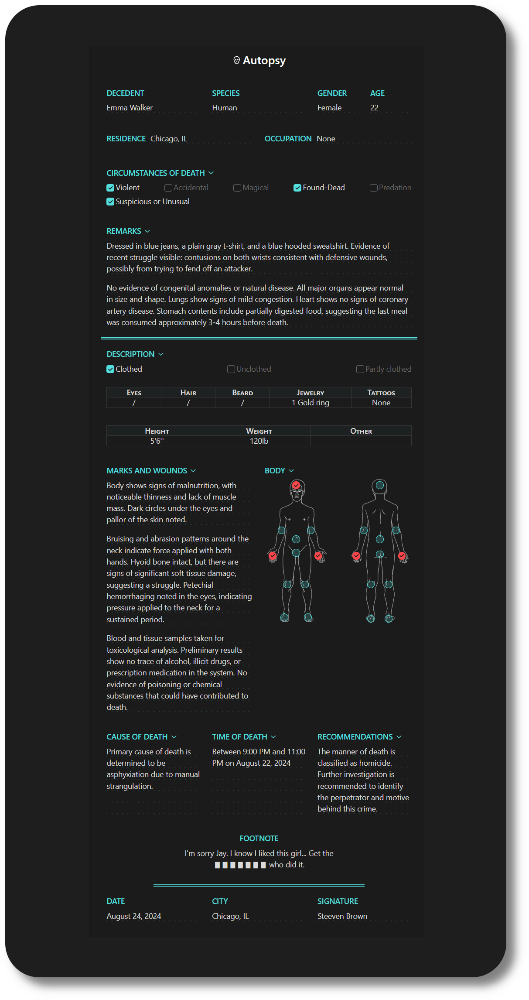
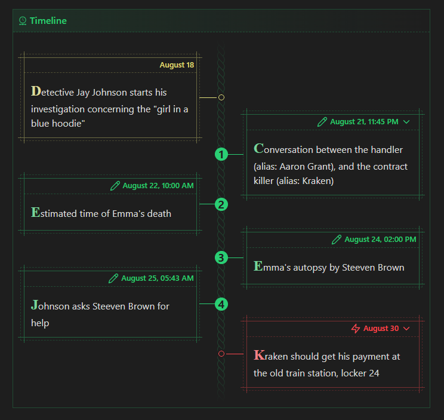
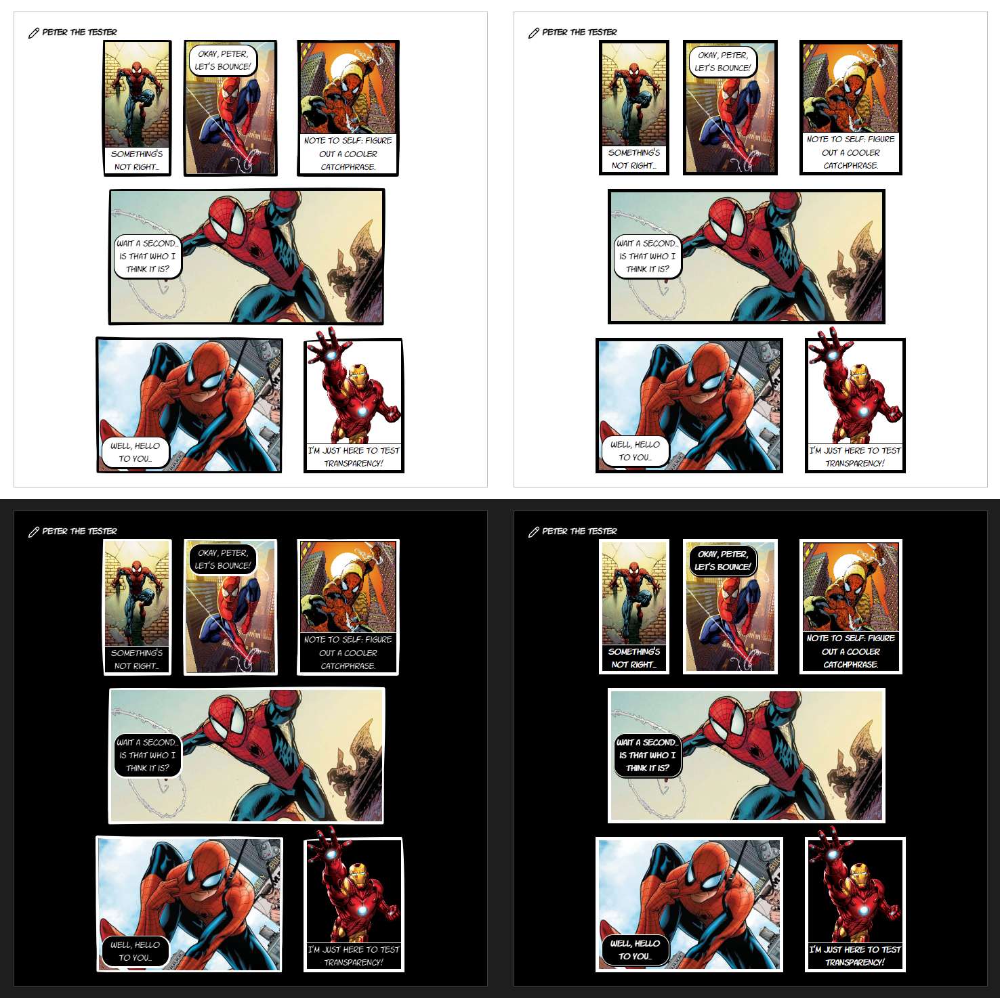

You will find in this folder several snippets to add new stylized callouts to your notes.

- [Usage](#usage)
- [Assets](#assets)
- [Compatibility issues](#compatibility-issues)
- [List of new callouts](#list-of-new-callouts)
   * [Clue](#clue)
      + [Tape A, Paper A (default)](#tape-a-paper-a-default)
      + [Tape B, Paper B](#tape-b-paper-b)
      + [Tape C, Paper C](#tape-c-paper-c)
      + [Tape D, Paper D](#tape-d-paper-d)
   * [Letter](#letter)
   * [Pinned](#pinned)
   * [Profile](#profile)
   * [Grid](#grid)
   * [Autopsy report](#autopsy-report)
      + [The Grid Layout](#the-grid-layout)
      + [Optional styles from the markdown](#optional-styles-from-the-markdown)
      + [The body schema and its checkboxes](#the-body-schema-and-its-checkboxes)
      + [Specific elements behaviors](#specific-elements-behaviors)
      + [Controlling colors](#controlling-colors)
   * [Screen](#screen)
   * [Email](#email)
   * [Timeline](#timeline)
   * [Timeline (variant)](#timeline-variant)
   * [Comic](#comic)

# Usage

Choose the snippets you want and include them in your `.obsidian/snippets/` folder.

# Assets

For styling effects, several of these snippets use images and specific fonts. As much as I can, I tried to embed them directly when I found free to use assets. You can find any source and licenses in the folder [assets license/](assets%20license/).

If any, the assets are always embed at the bottom of any css file. Sometimes, callouts come in different variants to pick one image among several. When this is the case, snippets can become heavy because they embed several images (see the `clue` callout for example). I tried as much as I could to reduce them using webp format, but still it can slow down the styling. Feel free to choose only one and remove the others if you know you won't use them.

# Compatibility issues

Some theme applies custom style to callouts. I can't test them all. So if you see any breaking when using a snippet, please open an issue or contact me on Discord and I will make the needed changes.

An other possible conflict is if other themes are using the same keywords than my snippets. Then things will get messy. You can change the used name in the css snippet. They are all using nested CSS code, so it should be easy to find the keyword to change, look for anything like `.callout[data-callout="keyword"]`.

# List of new callouts

## Clue

**FILE**: [callout-clue.css](callout-clue.css)

The snippet comes in several variations, 4 different tapes image (a, b, c, d), and 4 different paper images (a, b, c, d).  You can mix variants together, like `tape-b` and `paper-d`.

Versions A are used by default for both tape and paper, in case you don't specify anything. You can change that in the snippet, search for the comment `/* default */` and change value here.

When folded, only the tape is visible.

> [!NOTE]
> This snippet doesn't change between light and dark theme.

### Tape A, Paper A (default)


```md
> [!clue|tape-a paper-a]+ Clue
> The red-bearded man was seen at 2am at the docks.
```

or

```md
> [!clue]+ Clue
> The red-bearded man was seen at 2am at the docks.
```

### Tape B, Paper B


```md
> [!clue|tape-b paper-b]+ Clue
> The red-bearded man was seen at 2am at the docks.
```

### Tape C, Paper C


```md
> [!clue|tape-c paper-c]+ Clue
> The red-bearded man was seen at 2am at the docks.
```

### Tape D, Paper D


```md
> [!clue|tape-d paper-d]+ Clue
> The red-bearded man was seen at 2am at the docks.
```

## Letter

**FILE**: [callout-letter.css](callout-letter.css)

I deleted vertical spacing between paragraph to have equal line heigths. If you wish to change that, just change the variable `--p-spacing` in the snippet. The background lines will adapt, as they are computed per paragraph and not on the entire callout.


```md
> [!letter]+ Johnny Cash’s love letter to June Carter
> June 23 1994
>
> Odense, Denmark.
>
> Happy Birthday Princess,
>
> We get old and get used to each other. We think alike. We read each others minds. We know what the other wants without asking. Sometimes we irritate each other a little bit. Maybe sometimes take each other for granted.
>
> But once in awhile, like today, I meditate on it and realize how lucky I am to share my life with the greatest woman I ever met. You still fascinate and inspire me. You influence me for the better. You’re the object of my desire, the #1 Earthly reason for my existence. I love you very much.
>
> Happy Birthday Princess.
>
> John
```

## Pinned

**FILE**: [callout-pinned.css](callout-pinned.css)

You can specify three sizes in the callout:
- `small` (200px)
- `medium` (300px)
- `large` (100%)


```md
> [!pinned|medium]+ Chapter 1: Little blue hood
> Detective Johnson discovers a series of crimes linked to Emma, a young woman who always wears a blue hooded sweatshirt. After investigation, he understands that she is forced to work for someone else.
```


## Profile

**FILE**: [callout-profile.css](callout-profile.css)

This is a simple snippet that automatically set the first image to float right and of fixed min-width (default is 150px). You must keep the image as the first element, otherwise it will not be affected by the snippet.


```md
> [!profile]+ Emma
> ![[Emma.jpg]]
> 
> Emma, mid-twenties, slender build, around 5'6". Long brown hair, usually tied back. Pale complexion, dark circles under eyes. Often wears simple clothes, jeans, and a blue hoodie. Keeps a low profile, avoids eye contact. Nervous habits, bites her nails, fidgets with her hands. Soft-spoken, rarely raises voice. Appears guarded, always looking over her shoulder. Sense of sadness, eyes often downcast. Carries a worn-out notebook everywhere, possibly used for her forced writing.
> 
> Lives alone in a small apartment. Sparse and modest living conditions. No close family or friends, isolated. Seen meeting with a known felon, possibly her handler. Surveillance shows reluctance and anxiety during interactions. Seems desperate to escape but feels trapped. Detective suspects threats or blackmail used against her.
```


## Grid

**FILE**: [callout-grid.css](callout-grid.css)

Small snippet that applies a grid-layout to the content. You can set the callout to display 2 to 6 columns. Replace `x` by the desired number in the following: `> [!grid|x-col]`.


```md
> [!grid|3-col]+
> Why is Emma involved with these criminals? ...
>
> What leverage does her handler have over her? ...
>
> Her handler is always nearby, watching. ...
>
> What kind of criminal network are they a part of? ...
```

## Autopsy report

**FILE**: [callout-autopsy.css](callout-autopsy.css)

This snippet is more complex than others. It let you write in an autopsy report for your fiction. I took all of my inspiration from this [Reddit resource](https://www.reddit.com/r/Eberron/comments/o8ssdi/template_for_a_crown_necromancers_report_coroner/) that I tried to copy as best as I could.

Let's start with the screenshots to give you an idea of the result, and scroll down to see how it really works.

> [!WARNING]
> Since it's an autopsy report, the given "filled" example talks about murder for a thriller fiction. Read only if you're ok with it. The "template" is the report unfill so it's safe to open.

<details>
<summary><strong>Screenshots filled (dark theme)</strong></summary>




</details>

<details>
<summary><strong>Markdown filled</strong></summary>

```md
> [!autopsy]
> > [!decedent] Decedent
> > Emma Walker
>
> > [!species] Species
> > Human
>
> > [!gender] Gender
> > Female
>
> > [!age] Age
> > 22
>
> > [!residence|inline] Residence
> > Chicago, IL
>
> > [!occupation|inline] Occupation
> > None
>
> > [!circumstances]+ Circumstances of death
> > - [x] Violent
> > - [ ] Accidental
> > - [ ] Magical
> > - [x] Found-Dead
> > - [ ] Predation
> > - [x] Suspicious or Unusual
>
> > [!remarks|hr]+ Remarks
> > Dressed in blue jeans, a plain gray t-shirt, and a blue hooded sweatshirt. Evidence of recent struggle visible: contusions on both wrists consistent with defensive wounds, possibly from trying to fend off an attacker.
> > 
> > No evidence of congenital anomalies or natural disease. All major organs appear normal in size and shape. Lungs show signs of mild congestion. Heart shows no signs of coronary artery disease. Stomach contents include partially digested food, suggesting the last meal was consumed approximately 3-4 hours before death.
>
> > [!description]+ Description
> > - [x] Clothed
> > - [ ] Unclothed
> > - [ ] Partly clothed
> >
> > | Eyes | Hair | Beard | Jewelry | Tattoos |
> > | ---- | ---- | ----- | ------- | ------- |
> > |  /  |   /   |    /   |    1 Gold ring     |    None     |
> > 
> > | Height | Weight | Other |
> > | ------ | ------ | ----- |
> > | 5'6'' | 120lb |       |
>
> > [!marks-wounds]+ Marks and Wounds
> > Body shows signs of malnutrition, with noticeable thinness and lack of muscle mass. Dark circles under the eyes and pallor of the skin noted.
> > 
> > Bruising and abrasion patterns around the neck indicate force applied with both hands. Hyoid bone intact, but there are signs of significant soft tissue damage, suggesting a struggle. Petechial hemorrhaging noted in the eyes, indicating pressure applied to the neck for a sustained period.
> > 
> > Blood and tissue samples taken for toxicological analysis. Preliminary results show no trace of alcohol, illicit drugs, or prescription medication in the system. No evidence of poisoning or chemical substances that could have contributed to death.
>
> > [!body]+ Body
> > - [x] front head
> > - [ ] front left arm
> > - [ ] front right arm
> > - [x] front left hand
> > - [x] front right hand
> > - [ ] belly
> > - [ ] pelvis
> > - [ ] front left leg
> > - [ ] front right leg
> > - [ ] over left foot
> > - [ ] over right foot
> > - [ ] back head
> > - [ ] back left arm
> > - [ ] back right arm
> > - [x] back left hand
> > - [x] back right hand
> > - [ ] back
> > - [ ] bottom
> > - [ ] back left leg
> > - [ ] back right leg
> > - [ ] back left foot
> > - [ ] back right foot
>
> > [!cause]+ Cause of death
> > Primary cause of death is determined to be asphyxiation due to manual strangulation.
>
> > [!time]+ Time of death
> > Between 9:00 PM and 11:00 PM on August 22, 2024
> 
> > [!recommendations]+ Recommendations
> > The manner of death is classified as homicide. Further investigation is recommended to identify the perpetrator and motive behind this crime.
> 
> > [!footnote|no-dots hr] Footnote
> > I'm sorry Jay. I know I liked this girl... Get the ▮▮▮▮▮▮▮ who did it.
> 
> > [!date] Date
> > August 24, 2024
> 
> > [!city] City
> > Chicago, IL
> 
> > [!signature] Signature
> > Steeven Brown
```

</details>

<details>
<summary><strong>Screenshots template (light theme)</strong></summary>


</details>

<details>
<summary><strong>Markdown template</strong></summary>

```md
> [!autopsy]
> > [!decedent] Decedent
> > 
>
> > [!species] Species
> > 
>
> > [!gender] Gender
> > 
>
> > [!age] Age
> > 
>
> > [!residence|inline] Residence
> > 
>
> > [!occupation|inline] Occupation
> > 
>
> > [!circumstances]+ Circumstances of death
> > - [ ] Violent
> > - [ ] Accidental
> > - [ ] Magical
> > - [ ] Found-Dead
> > - [ ] Predation
> > - [ ] Suspicious or Unusual
>
> > [!remarks|hr]+ Remarks
> > 
>
> > [!description]+ Description
> > - [ ] Clothed
> > - [ ] Unclothed
> > - [ ] Partly clothed
> >
> > | Eyes | Hair | Beard | Jewelry | Tattoos |
> > | ---- | ---- | ----- | ------- | ------- |
> > |        |        |         |            |             |
> > 
> > | Height | Weight | Other |
> > | ------ | ------ | ----- |
> > |           |           |         |
>
> > [!marks-wounds]+ Marks and Wounds
> > 
>
> > [!body]+ Body
> > - [ ] front head
> > - [ ] front left arm
> > - [ ] front right arm
> > - [ ] front left hand
> > - [ ] front right hand
> > - [ ] belly
> > - [ ] pelvis
> > - [ ] front left leg
> > - [ ] front right leg
> > - [ ] over left foot
> > - [ ] over right foot
> > - [ ] back head
> > - [ ] back left arm
> > - [ ] back right arm
> > - [ ] back left hand
> > - [ ] back right hand
> > - [ ] back
> > - [ ] bottom
> > - [ ] back left leg
> > - [ ] back right leg
> > - [ ] back left foot
> > - [ ] back right foot
>
> > [!cause]+ Cause of death
> > 
>
> > [!time]+ Time of death
> > 
> 
> > [!recommendations]+ Recommendations
> > 
> 
> > [!footnote|no-dots hr] Footnote
> > 
> 
> > [!date] Date
> > 
> 
> > [!city] City
> > 
> 
> > [!signature] Signature
> > 
```

</details>

### The Grid Layout

This snippet works with a grid layout inside the main calout's `.callout-content`.

Grid is 6 columns, following the following layout:


**What you *can* do without modifying the CSS**
- Change the names of the displayed sections, as they come from the callout title.
- Remove sections, they will leave empty spaces.
- Add callouts with other names (or any block really): they will each of them take one space (one row span, one column span), starting with the left of the footnote, then right, then it will start new lines.

**What you *cannot* do without modifying the CSS**
- Change the grid layout.
- Change the callout identifier (keywords used in `> [!callout-id]`) used in the grid layout.

### Optional styles from the markdown

The snippet let you have just a few controls over the style of the final result, by using callouts metadata: `> [!callout-id|callout-metadata-1 callout-metadata-2]`. Followings are available:
- `hr`: add a bottom double border under the section (in example: `remarks` and `footnote` sections)
- `inline`: inline in the same flow the title of the section and its content (in example: `redisence` and `occupation` sections)
- `no-dots`: remove the dotted lines under the text (in example: `footnote` section)

### The body schema and its checkboxes

The *only* section you should not change, is the `> [!body]` callout. The checkboxes are placed just at the right position to match a schema of a human body in the background. Changing the content here will break this effect. However, you can change the labels, which will be shown when hovering the checkboxes in a tooltip.

If you wish to use your own background schema and your own checkboxes, you will have to change all the absolute positionings in the code. As well as this three variables that can be found at the end of the file:
```css
.callout[data-callout="body"] {
    --body-img-base-width: 750;  /* don't put unit here, its only to compute a ratio */
    --body-img-base-height: 768; /* don't put unit here, its only to compute a ratio */
    --body-img: url('')
}
```

The code expects a black schema outline readable for light theme, and will automatically add an inverse filter to make it usable in dark theme. So black outlines will be changed in white outlines, you do not have to provide two images.

### Specific elements behaviors

- **Tasks list** are inlined to expand horizontaly rather than stacked verticaly.
- **Spacings** between elements are controled by `gap` property and everything else (`margin` and `padding`) is mainly set to `0`.

### Controlling colors

Colors are set as follow:
```css
.callout[data-callout="autopsy"] {
    /* Color of the main callout background
       Splitted R G B values */
    --callout-color: var(--mono-rgb-0);

    /* Color of the nested callouts
       (used for the titles, checkboxes, borders, dots, table headers)
       Splitted R G B values */
    --callout-color-nested: var(--color-blue-rgb);

    /* Color of the main "Autopsy" title
       Splitted R G B values */
    --callout-title-color: rgb(var(--mono-rgb-100)); 
}
.callout[data-callout="autopsy"] .callout[data-callout="body"] {
    /* Color of the checked checkboxes on the body schema */
    --checkbox-color: var(--color-red);
}
```

You can copy this code in a new snippet and change them to override the default if you do not wish to search for them into the code (or avoid loosing them in case you update the snippet later).

## Screen

**FILE**: [callout-screen.css](callout-screen.css)

You can now create a old-retro-glowing-green screen with this new callout.
Works best in dark mode, I think.


```md
> [!screen]+ Leaked Conversation Log, August 21, 2024
> Source: Dark Web Forum - “Silencer’s Haven”
> 
> **Aaron Grant** (11:45 PM): Need you to take care of the girl. She’s becoming a liability. Seen talking to a cop recently. You know what to do.
>
> **Kraken** (11:47 PM): Understood. When and where?
>
> **Aaron Grant** (11:48 PM): Tomorrow night. Usual place. Warehouse on 5th and Elm, near the docks. Back entrance. Make it clean. No mess, no traces.
>
> **Kraken** (11:49 PM) Got it. What about her stuff?
> 
> **Aaron Grant** (11:50 PM) Burn everything. Papers, phone, any evidence she might have. Nothing should lead back to us. You’ll find a burner cell in the usual drop spot for confirmation. Code: 8924. Use it to send me the all-clear once it’s done.
>
> **Kraken** (11:51 PM): Understood. Payment?
>
> **Aaron Grant** (11:52 PM): Same as before. Cash drop at the old train station, locker 24. You’ll have it by Friday. Don’t screw this up. We can’t afford any more attention.
>
> **Kraken** (11:53 PM): Consider it done. She won’t be a problem anymore.
```

## Email

**FILE**: [callout-email.css](callout-email.css)

Use this snippet to create email-like callouts. Any nested callout will be given the visual effect of an input, so best is to keep them at the beginning. To have a separator, add `sep` as an option of your last nested callout, this will give it a bottom border.

You can choose colors from the [Obsidian extended color palette](https://docs.obsidian.md/Reference/CSS+variables/Foundations/Colors#Extended%20colors), like so: `> ![email|color]`. Available colors are red, orange, yellow, green, cyan, blue, purple, and pink. If no color is provided, the email callout will be grey.


```md
> [!email]+ 
> > [!note] Subject
> > Need help, Off the record
>
> > [!note] From
> > Jay Johnson
>
> > [!note] To
> > Steeven Brown
>
> > [!note|sep] At
> > August 25, 2024, 05:43 AM
> 
> Steev,
>
> I can’t go through official channels on this one. I found out where Emma’s killer will be this Friday —  old train station, locker 24. I want to catch him and take him down myself. Problem is, I can’t risk having the cops involved. They’ll only slow me down with red tape and protocols.
>
> I need you there, just in case things go south. Your medical expertise could be crucial if anyone gets hurt, including the killer. I need to keep him alive. I trust you to keep this off the books.
> Emma’s death is on my shoulders, and I have to make this right. Can you be there Friday evening, ready to step in if needed?
>
> Let me know ASAP.
> Jay
```

## Timeline

**FILE**: [callout-timeline.css](callout-timeline.css)

Use this snippet to create a timeline. Several options are available.:
- At the first level timeline callout `> ![timeline|option]`:
  - `no-icon`: remove all icons from callout title, the main and the nested ones.
  - `red`, `orange`, `yellow`, `green`, `cyan`, `blue`, `purple`, and `pink`: use the corresponding [extended color](https://docs.obsidian.md/Reference/CSS+variables/Foundations/Colors#Extended%20colors) to color the timeline.
  - `numbered`: add increasing numbers inside the bullets for each item.
  - `horizontal`: make the timeline horizontal (vertical by default).
- In nested callouts:
  - `no-icon`: remove the icon of this callout.
  - `red`, `orange`, `yellow`, `green`, `cyan`, `blue`, `purple`, and `pink`: color this callout with the given color. Using a callout with an existing default color will also change its color, you don't have to specify it for callouts such as bug, abstract, example, quote, etc. Unless you want to change the default.
  - `skip`: don't count this block in the numbering (require `numbered` at the first level callout)

Note that inside the timeline callout, you can use what you want. All blocks will be transformed into "date cards", not only callouts. So paragraphs, blockquotes, code, etc., they all work. But callouts are the only one you can add options to.


```md
> [!timeline|numbered blue] Calculus course progress
> > ### Limits and Continuity
> > $$\lim_{x \to c} f(x)$$
>
> > [!note]+ Techniques for finding limits
> > - Direct substitution
> > - Factoring and simplifying
> > - Rationalizing
> > - Limits involving infinity
>
> > [!note] Continuity
> > - Definition of continuity at a point
> > - Continuity on an interval
> > - Intermediate Value Theorem
> 
> > [!important]
> > Homework 1
> 
> > ### Derivatives
> > $$f'(x) = \lim_{h \to 0} \frac{f(x+h) - f(x)}{h}$$
> 
> > [!note|skip]+ Differentiation rules
> > - Power rule: $(x^n)' = nx^{n-1}$
> > - Constant multiple rule: $(cf(x))' = cf'(x)$
> > - Sum and difference rules: $(f(x) \pm g(x))' = f'(x) \pm g'(x)$
> > - Product rule: $(f(x)g(x))' = f'(x)g(x) + f(x)g'(x)$
> > - Quotient rule: $\left(\frac{f(x)}{g(x)}\right)' = \frac{f'(x)g(x) - f(x)g'(x)}{[g(x)]^2}$
> > - Chain rule: $(f(g(x)))' = f'(g(x)) \cdot g'(x)$
> 
> ```py
> from sympy import symbols, diff
> x = symbols('x')
> f = 3_x**2 + 2_x + 1
> f_prime = diff(f, x)
> print(f_prime)
> ```
>
> Implicit differentiation
>
> > [!important|red]
> > **Exam**
> 
> > ### Applications of Derivatives
> > $f''(x), f'''(x), \ldots$
> 
> > [!note]+ Finding local extrema (maxima and minima)
> > - Critical points
> > - First Derivative Test
> > - Second Derivative Test
```


```md
> [!timeline|orange horizontal no-icon] Dune movies
> > [!note]+ Dune (1984)
> > David Lynch's Adaptation That Feels Both Rushed & Overextended
> > ![[Dune (1984).jpg|100]]
> 
> > [!note]+ Dune (2000)
> > A Very Faithful Miniseries Held Back By Its Digital Limitations 
> > ![[Dune (2000).jpg|100]]
> 
> > [!note]+ Children Of Dune (2003) 
> > A TV Miniseries That Merges Children Of Dune & Dune Messiah Into One Story
> > ![[Children Of Dune (2003).jpg|100]]
> 
> > [!note]+ Jodorowsky's Dune (2013)
> > A Mesmerizing Documentary About What Could Have Been
> > ![[Jodorowsky's Dune (2013).jpg|100]]
> 
> > [!note]+ Dune (2021) 
> > A Sci-Fi Epic That Adapts The First Half Of The Novel 
> > ![[Dune (2021).jpg|100]]
> 
> > [!note]+ Dune: Part 2 (2024) 
> > Director Denis Villeneuve's Masterpiece & The Best Sci-Fi Film In Years
> > ![[Dune Part 2 (2024).jpeg|100]]
```

## Timeline (variant)

**FILE**: [callout-timeline-variant.css](callout-timeline-variant.css)

This is another style variant of the timeline callout, more adapted to my personal theme. Options are exactly the same.

> [!WARNING]
> Do not use both timeline snippets at the same time, they are in conflict.



```md
> [!timeline|green numbered]
> > [!note|skip no-icon yellow] August 18
> > Detective Jay Johnson starts his investigation concerning the "girl in a blue hoodie"
> 
> > [!note]+ August 21, 11:45 PM
> > Conversation between the handler (alias: Aaron Grant), and the contract killer (alias: Kraken)
> 
> > [!note] August 22, 10:00 AM
> > Estimated time of Emma's death
> 
> > [!date] August 24, 02:00 PM
> > Emma's autopsy by Steeven Brown
> 
> > [!date] August 25, 05:43 AM
> > Johnson asks Steeven Brown for help
> 
> > [!danger|skip]+ August 30
> > Kraken should get his payment at the old train station, locker 24
```


## Comic

**FILE**: [callout-comic.css](callout-comic.css)

If you like comics, this snippet can be for you. Inside a `comic` callout, add `comic-panel` nested callouts with two blocks only: one image, and one short text. See the schema after the example code for reference.

You can use the option `straight` to use only straight borders instead of the default that add a hand drawn effect: `> [!comic|straight]`.

There is an option to turn everything black and white: `> [!comic|no-color]`.

On the panels, you can add the option `|overflow` to let an image slightly overflow the content from the top. See last panel of the example. Only use this feature with transparent images.



```md
> [!comic]
> > [!comic-panel]
> > ![[Spiderman 1.png]]
> > 
> > Something’s not right...
> 
> > [!comic-panel]
> > ![[Spiderman 2.png]]
> > 
> > Okay, Peter, let's bounce!
> 
> > [!comic-panel]
> > ![[Spiderman 3.png]]
> > 
> > Note to self: figure out a cooler catchphrase.
> 
> > [!comic-panel]
> > ![[Spiderman 4.png]]
> > 
> > Wait a second... is that who I think it is?
> 
> > [!comic-panel]
> > ![[Spiderman 5.png]]
> > 
> > Well, hello to you...
> 
> > [!comic-panel|overflow]
> > ![[Iron man.png]]
> > 
> > I'm just here to test transparency!
```

