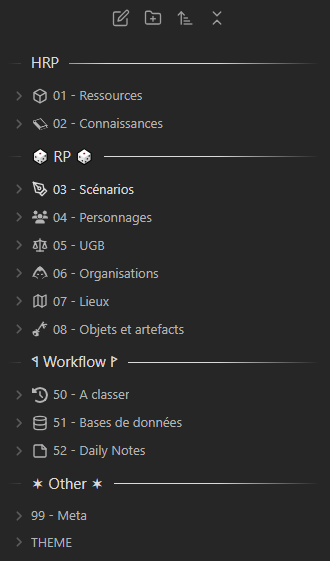

This snippet let you add separators in you file explorer.

Original idea is from Saltmaker. A lot of other people have added nice improvements. I tried to bundle everything in one snippet so you can tweak it easily to achieve the desired result.

Please refer to the comments in the code to see how you can change the overall styling.

If you don't want any line, you can find an already existing snippet in [r-u-s-h-i-k-e-s-h collection](https://github.com/r-u-s-h-i-k-e-s-h/Obsidian-CSS-Snippets/blob/Collection/Snippets/File%20explorer%20styling%20-%20Folder%20headers.md) that provide an "only text".

   
