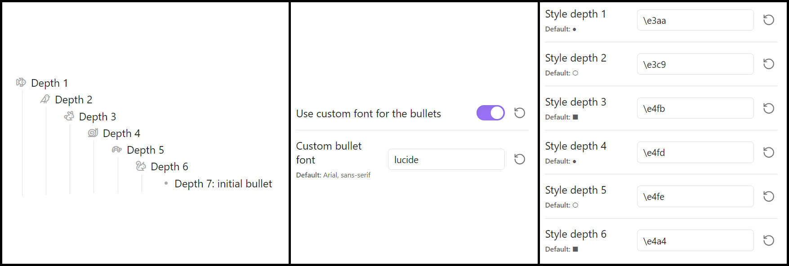

This snippet let you customize list styling in live preview and preview modes, for both ordered and unordered lists, up to 6 depth-levels. No more all-the-same numberings and bullets. You can now change the way your list items are marked and use counters such as (*a, b, c, d, e, f*), or (*I, II, III, IV, V, VI*).

> [!TIP]
> It is recommended to use this plugin with the Style settings plugin (see below).

# Usage

Just write your list as always, the underlying markdown does not change.

> [!NOTE]
> This snippet doesn't affect source view on purpose. If it did, it would hide the real markdown source.

By default, the snippet creates this list styles, repeating three different styling:


# Style settings

The snippet is best used with [Style Setting plugin](https://github.com/mgmeyers/obsidian-style-settings) in order to create your own list styles.

Following features are available:
- [x] Color the numberings, bullets, and indentation guide;
- [x] Choose your own set of 6 numberings styles for ordered list;
- [x] Choose your own set of 6 bullet characters for unordered list;
- [x] Choose only one unique bullet for all unordered list depths;
- [x] Choose the color of the numbering/bullets (including normal text color);
- [x] Make the numberings and bullets bold;
- [x] Make the numberings and bullets glow;
- [x] Choose a specific font for the bullets (unordered list) in case your text font-family scales the unicode characters in an undesired way;
- [x] Enable or disable the styling on the active line on live preview mode;
- [x] Control indentations. 

## Showcase

### Custom style

In the screenshot below, following settings were used:
- "Use custom color" set to `true`
- Custom color set to `#e519d4`
- "Bold numbering and bullets" set to `true`
- Style depths for ordered lists (from 1 to 6)
  1. upper-alpha
  2. lower-alpha
  3. upper-roman
  4. lower-roman
  5. decimal
  6. lower-greek
- Style depths for unordered lists (from 1 to 6)
  1. ◈
  2. ◉
  3. ▣
  4. ◐
  5. ◑
  6. ◱


### Active line disabled

By default, the active line is not affected by the change of numbering/bullet. This let you see the underlying markdown without having to switch to source mode, and ease the access to the markdown list marker (`- `, `1. `, `2. `, etc.)


This behavior can be changed and the styling can be enabled on active line from the style settings.

### Glow

You can enable a soft glow for your numbering and bullets.


### Bullet font

While working on this snippet with someone else, we found out that some fonts change the scales of the unicode characters and make the bullets look odd. The option to use a specific font for the bullets can fix this.


### Emoji list (unordered lists)

Because the bullets for the unordered lists are essentialy just characters, you can use any Unicode Character supported by your font, such as emojis. You can either use the unicode css code such as `\1f355` (🍕) (first style settings example), or directly copy paste the character (second style settings example).


### Icon list (unordered lists)

Some fonts take advantage of the Unicode [Private Usage Area](https://en.wikipedia.org/wiki/Private_Use_Areas) to define their own icons directly as unicode character in the font. This is for example the case for [Lucide](https://lucide.dev/), [Font Awesome](https://fontawesome.com/), etc. As long as Obsidian have access to such a font, you can use their icons by enabling the custom font for the bullets.

There are several ways to access such font:
- Add a css-snippet with a `@font-face` linking to the web hosted font file. **Only works online**.
```css
/* Enable Lucide Icons using the font "LucideIcons" */
@font-face {
  font-family: 'lucide';
  src: url(https://unpkg.com/lucide-static@latest/font/lucide.ttf) format('truetype');
}
```
- Add a css-snippet with the font in a base64 encoding. You could use the [Custom Font Plugin](https://github.com/pourmand1376/obsidian-custom-font) plugin, or do it manualy following the [Obsidian documentation](https://docs.obsidian.md/Themes/App+themes/Embed+fonts+and+images+in+your+theme). **Works offline**.
- Install the font locally on your machine. **Works offline but only on machine where the font has been installed**.

To know which icon is using which character if the official website doesn't provide this information, you can use a third party tool to show the glyphs (icons) and their codes. Offline and online solution exists, such as [Torinak](https://torinak.com/font/lsfont.html) (I have no connection with them, it's just my favorites of the ones I've tried).

