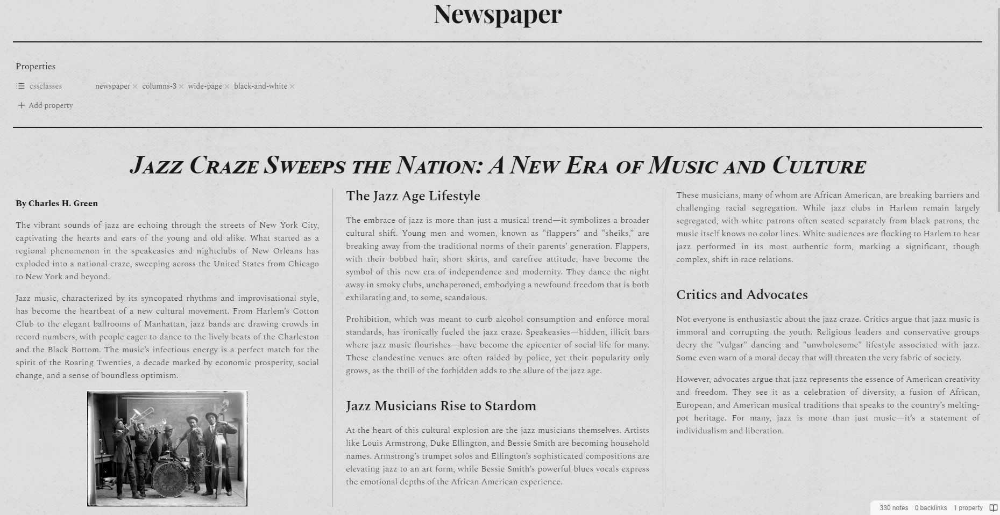

Add a vintage newspaper style to your notes!

# Usage

> [!IMPORTANT]
> Use **only one** snippet at a time in your vault.

The snippet comes in two versions:
- [`newspaper.css`](newspaper.css): add multiple cssclass to choose only the ones you need
  - `newspaper`: mainly changes fonts, and add the horizontal borders.
  - `columns-2`, `columns-3` and `columns-4`: create a multiple columns layout (2, 3 or 4 columns). Header of level 1 are used to stop the column and restart again, as well as any element with the attribute `alt="span"`, so you can use images that span over all columns by writing `![[image.png|span]]`. If you wish to add other headers level to also break the column layout, add them in line 100 (example: `:is(h1, h2, h3)`).
  - `wide-page`: makes the page of non readable length so it expends full width.
  - `black-and-white`: turns the page in black and white.
- [`newspaper-all-in-one.css`](newspaper-all-in-one.css): add only one cssclass `newspaper` which is a combination of `newspaper` + `columns-3` + `wide-page` + `black-and-white` from the aforementioned snippet, so you don't need to specify all of them everytime.

# Fonts

Used fonts are:
- [*Playfair Display*](https://fonts.google.com/specimen/Playfair+Display) for the inline title and small headings (from Google Fonts)
- *Times New Roman* The H1 headings
- [*Spectral*](https://fonts.google.com/specimen/Spectral) for the body (from Google Fonts)

Google Fonts are imported directly from the website, which means that the fonts are downloaded and you need to be online to use them. If you want to use them offline, download them and either install them on your computer, or [embed them in a css file](https://docs.obsidian.md/Themes/App+themes/Embed+fonts+and+images+in+your+theme).

# Background image

In the screenshot, I'm using a transparent background to add a paper effect. This is not included in the snippets. However, I added the code to add your own background easily from an online url.

Both `newspaper` and `black-and-white` cssclasses are ready to welcome a background image (however if you use both at the same time, only the newspaper one will be applied).

