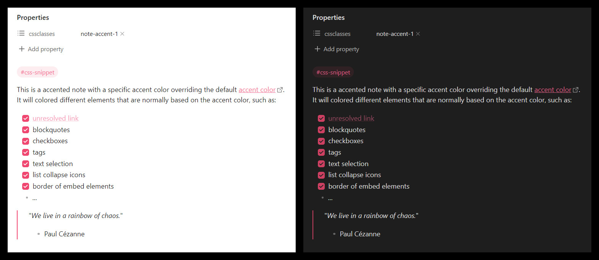
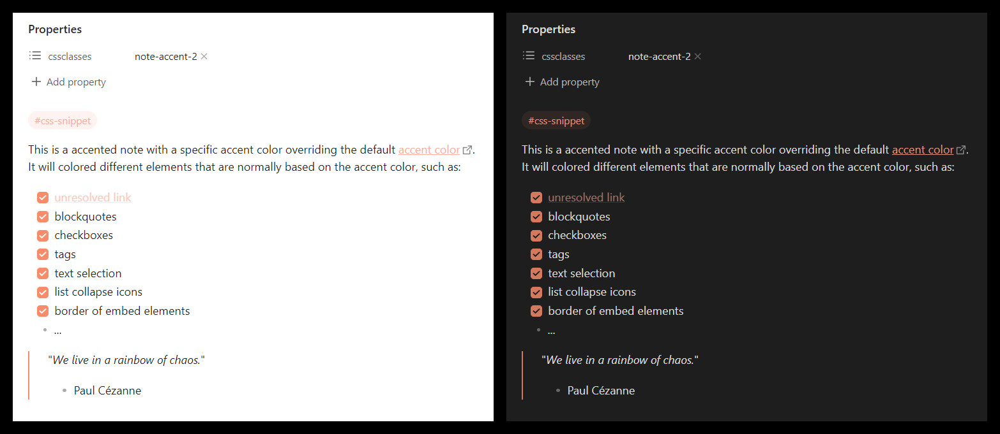
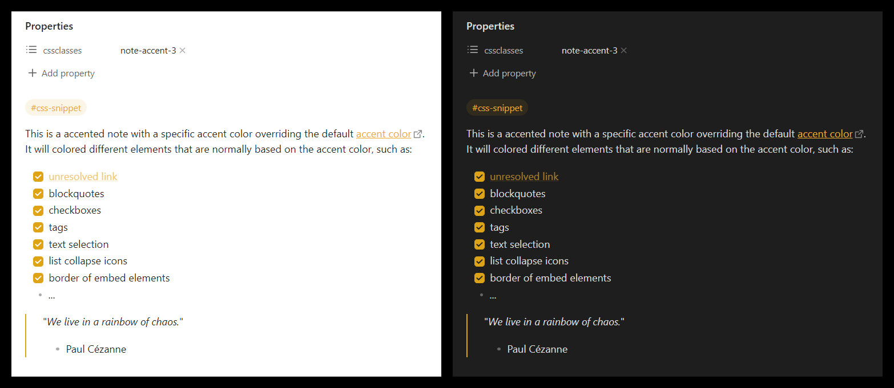
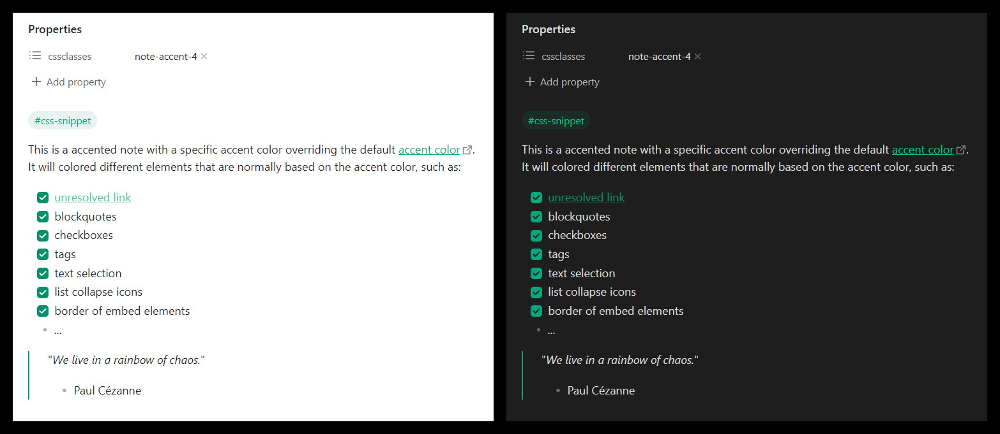
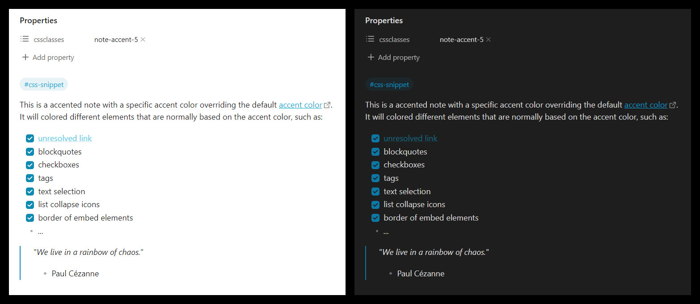
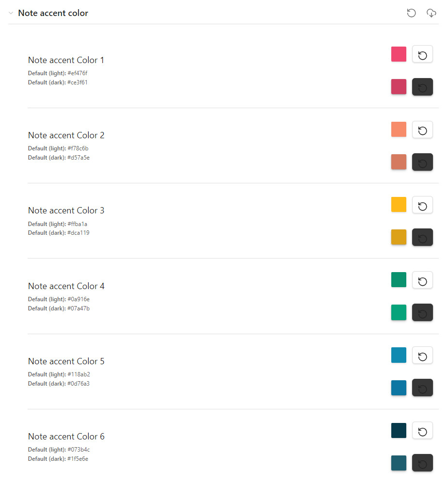

This snippet provides 6 css classes to add a custom accent color on specific notes.

# Installation

Download the `note-accent-colors.css` file and add it to your snippets.
Please reffer to the [Obsidian documentation](https://help.obsidian.md/Extending+Obsidian/CSS+snippets) to see how to install a css snippet.

# Usage

Add one of the following css class to the property of a note:
- note-acent-1
- note-acent-2
- note-acent-3
- note-acent-4
- note-acent-5
- note-acent-6

# Screenshots with default colors (default obisidian theme)

# Style settings

The snippet offers settings that can be tweaked with [Style Setting plugin](https://github.com/mgmeyers/obsidian-style-settings) in case you want to change the 6 default colors.

# Conflict with other themes and styling

The goal of this plugin is to override the vault accent color on specific notes. So it should also override the colors of the theme if the redefine the accent color.

However, some themes use the accent color to style other elements, such as bold or italic texts. If those elements are not using the accent color in the Obsidian default theme, this snippet will probably not apply the new note accent color on them. The reason behind this is that the note-accent-colors are computed at the level of the markdown view in the DOM, and any color using the accent color need to be recomputed at the same level (or deeper) to take into account the changes. I tried to cover all the cases in the Obsidian default theme but I didn't try to cover the cases in other themes because they are so many. However, if you would want this snippet to support a specific theme, feel free to ask and I will do my best to provide an extended snippet!