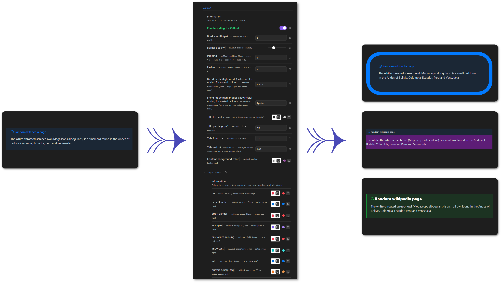

> [!CAUTION]
> Work in progress. Still debugging.

I created this snippet while learning about all the CSS variables that Obsidian gives us control over. [The documentation](https://docs.obsidian.md/Reference/CSS+variables/CSS+variables), while very useful, doesn't show how the variables are connected. So I looked at the Obsidian base css code and created the snippet along the road so I could change and see how the variables impact the final theme.

> [!IMPORTANT]
> **I do not recommend this snippet for a permanent styling of your vault**.
> - It will broke several chains of referencing variables.
> - There is a high risk of conflict with any other theme or snippet.
> - Values are all hard coded, maintenance will suffer from that.

That being said, I believe this snippet could help to understand how variables are used in the style of Obsidian and trying things without the need to change any css snippet. I did my best to write down every connexion between the variables, so you can see when a CSS variable is based on another.

Once you are happy with a result, I would strongly recommend to save the changes in a separate css snippet and not rely on this tool anymore.

# Usage

> [!IMPORTANT]
> **Required**: [Style Setting plugin](https://github.com/mgmeyers/obsidian-style-settings)

- Download [tweak-css-variables](tweak-css-variables.css) css snippet and add it to your Vault's snippets.
- Go in the options of the Style Setting plugin and open the "Tweak CSS variables" section.
- Start exploring and playing with more than 500 different variables and see the changes live!

I recommend to open the settings in a new window so you can change them and still see the result in your Vault without the need to close the setting pane every time.

> [!TIP]
> Start with the Foundations sub-section, this is where the base variables are (like `--color-red` or `--background-primary`) and you will see the more global changes.

# How it works

I grouped CSS variables by theme, following the same outline as the official documentation. The snippet first modify variables prefixed with `kpr-`, and they are affected to Obsidian's variables only when their group is active. For example, the Obsidian variable `--text-normal` will be set to `--kpr-text-normal` only once "*styling for Text colors*" is enabled.

I tried to give control over as many variables as possible. I missed a few intentionnaly because they would have been too complex to add. I also computed automatically some `xxx-hover` colors associated to a property, but when I did so it is written in the setting description.

> [!WARNING]
> - Only thought for PC, not mobile, not print.
> - Default values are hardcoded base on the Obsidian default theme.

# Outline

<details>

<summary><strong>Outline with number of variables in each section</strong></summary>

Each checkbox `☑` corresponds to a group of variables that are all enabled together.

```css
Tweak CSS variables (593)
├─ Components (139)
│  ├─ ☑ Button (1)
│  ├─ ☑ Checkbox (8)
│  ├─ ☑ Dialog (3)
│  ├─ ☑ Dragging (2)
│  ├─ ☑ Dropdown (5)
│  ├─ ☑ Indentation guides (7)
│  ├─ ☑ Modal (10)
│  ├─ ☑ Multi-select (15)
│  ├─ ☑ Navigation (27)
│  │  ├─ Items (17)
│  │  ├─ Indentation guides and collapse icons (4)
│  │  ├─ Headings (6)
│  ├─ ☑ Popover (6)
│  ├─ ☑ Prompt (6)
│  ├─ ☑ Slider (8)
│  ├─ ☑ Tabs (18)
│  ├─ ☑ Tab stacks (8)
│  ├─ ☑ Text input (4)
│  ├─ ☑ Toggle (11)
│  │  ├─ Small toggle (4)
├─ Editor (241)
│  ├─ ☑ Blockquote (5)
│  ├─ ☑ Callout (26)
│  │  ├─ Type colors (14)
│  ├─ ☑ Code (15)
│  │  ├─ Syntax highlighting (11)
│  ├─ ☑ Collapse icon (2)
│  ├─ ☑ Embed (9)
│  ├─ ☑ File (9)
│  ├─ ☑ Headings (43)
│  │  ├─ H1 (7)
│  │  ├─ H2 (7)
│  │  ├─ H3 (7)
│  │  ├─ H4 (7)
│  │  ├─ H5 (7)
│  │  ├─ H6 (7)
│  ├─ ☑ Horizontal rules (2)
│  ├─ ☑ Inline title (8)
│  ├─ ☑ Link (14)
│  ├─ ☑ List (15)
│  ├─ ☑ PDF View (6)
│  ├─ ☑ Properties (35)
│  │  ├─ Properties container (9)
│  │  ├─ Individual properties (26)
│  │  │  ├─ Divider (4)
│  │  │  ├─ Property (7)
│  │  │  ├─ Labels (8)
│  │  │  ├─ Inputs (7)
│  ├─ ☑ Table (38)
│  │  ├─ Table header (8)
│  │  ├─ Table text (3)
│  │  ├─ Table column (5)
│  │  ├─ Table row (4)
│  │  ├─ Table selection (6)
│  │  ├─ Table drag handle (4)
│  │  ├─ Table "add" button (3)
│  ├─ ☑ Tag (14)
├─ Foundations (146)
│  ├─ ☑ Borders (1)
│  ├─ ☑ Base colors (12)
│  ├─ ☑ Extended colors (8)
│  ├─ ☑ Black and white (2)
│  ├─ ☑ Semantic colors (34)
│  │  ├─ Surface colors (16)
│  │  ├─ Interactive colors (5)
│  │  ├─ Text colors (13)
│  │  │  ├─ Text foreground colors (10)
│  │  │  ├─ Text background colors (2)
│  │  │  ├─ Caret color (1)
│  ├─ ☑ Icons (17)
│  │  ├─ Icon sizes (10)
│  ├─ ☑ Layers (10)
│  ├─ ☑ Radiuses (4)
│  ├─ ☑ Shadow (8)
│  ├─ ☑ Spacing (16)
│  ├─ Typography (34)
│  │  ├─ ☑ Font (5)
│  │  ├─ ☑ Font size (9)
│  │  ├─ ☑ Font weight (9)
│  │  ├─ ☑ Text formatting (6)
│  │  ├─ ☑ Line height (2)
│  │  ├─ ☑ Paragraph spacing (3)
├─ Plugins (34)
│  ├─ ☑ Canvas (9)
│  │  ├─ Palette (6)
│  ├─ ☑ File explorer (3)
│  ├─ ☑ Graph (8)
│  ├─ ☑ Search (5)
│  ├─ ☑ Sync (9)
├─ Window (33)
│  ├─ ☑ Divider (4)
│  ├─ ☑ Ribbon (4)
│  ├─ ☑ Scrollbar (3)
│  ├─ ☑ Sidebar (2)
│  ├─ ☑ Status bar (7)
│  ├─ ☑ Vault profile (4)
│  ├─ ☑ Window frame (8)
│  ├─ ☑ Workspace (1)
```

</details>

# Bugs, errors and typos

I spent several hours doing copy/pasting and repetitive actions. There is a high risk that I did some errors. As there are almost 600 variables that this snippet can override, I couldn't try them all. Yet. Eventually, I hope having the patience to try them all. Meanwhile, be warned that bugs can happend. If you see one, please contact me so I can fix it as quick as possible :smiley:

# Separate snippet for the settings pannel

Because this snippet can result in a very long section in the Style Settings plugin's parameters, I decided to write another css snippet to change the visual appearance of the settings pane just for the *Tweak CSS variables* group and reduce its size. You can download the file [tweak-css-variables-style](tweak-css-variables-style.css) if you want the same result (minus your own theme).

# Screenshots

All the screenshots uses the tweak-css-variables-style snippet.

## Base colors


## Code


## Callout



## List

### Example 1

- **Components > Indentation guides**
  - Border width: `3px`
  - Border color: `#ECFF001F`
  - Width of the indent in read mode: `-1.2em`
- **Editor > List**
  - Indentation width for nested items: `4em`
  - Marker color: `#E3ED70`
  - Bullet border width: `2px`
  - Bullet border style: `solid`
  - Bullet border color: `#E45811`
  - Bullet width/height: `0.8em`
  - Bullet transform property: `translateX(-5px)`
  - list-style-type for numbered list: `upper-roman`


### Example 2

- **Editor > Collapse icon**
  - Icon color (collapsed): `#E45811`

- **Editor > List**
  - Vertical spacing between lines: `0em`
  - Marker for collapsed items: `#E45811`
  - Bullet radius: `0%`
  - Bullet transform property: `rotate(45deg)`


## Text formatting

- **Foundations > Typography > Text formatting**
  - Added weight for bolded text: `400`
  - Bold text color: `#93EB9C`
  - Italic text color: `#75E8D6`

